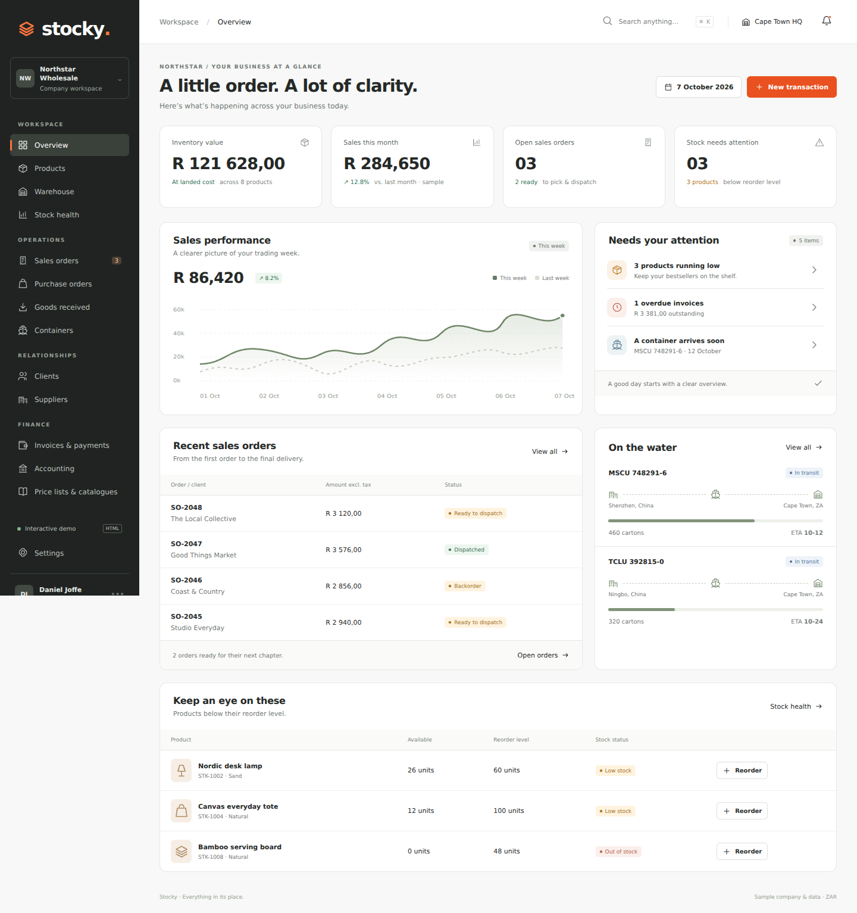

# Stocky

A polished, static HTML prototype for a single-company wholesale inventory, operations and accounting platform.

## Open it
For a single-file version, open **`stocky.html`**. It contains all CSS and JavaScript and works offline.

For the editable source version, open `index.html` directly in a modern browser. No install, build step, API keys or server are required. Alternatively run `python3 -m http.server 8000` in this folder.

Static hosting: publish the repository root using any static host. Framework preset: Other. Build command: none. Output directory: repository root. This repository has not been deployed by the prototype build.

## Included
- Overview with sample sales trends, stock alerts and incoming containers.
- Products: primary SKU plus **three alternate codes**, categories, subcategories, variants, weight, expiry, up to five photos, cost and price.
- Packaging: cartons contain inners; inners contain individual units. Stock is stored in individual units.
- A single warehouse with 18 selectable bins and recorded stock adjustments.
- Sales orders, reservation, backorders, allocation, dispatch and printable waybills.
- Purchase orders and GRVs: actual accepted/rejected quantities, partial receipts, supplier reference and destination bin.
- Containers with origin, ETA, carton count and landed-cost breakdown.
- Client and supplier profiles, contact details, payment terms and opening balances.
- Invoices with partial/full payment recording and printable previews.
- Full-accounting **UI concepts**: financial overview, banking/reconciliation, supplier bills and payments, chart of accounts, general ledger, balanced two-line journals, profit and loss, balance sheet, trial balance, cash flow, ageing concepts and tax summary.
- Three price lists and a printable catalogue.
- Search, category/status filters, CSV exports, keyboard shortcut Cmd/Ctrl+K, responsive navigation and modal forms.
- Local browser persistence and a confirmed demo reset under Settings.

## Scope and limits
This is a brainstorming and client-review prototype, not a production system. All initial records are fictional sample data. Sales graphs and financial statements are labelled illustrative snapshots. Accounting statements do not recalculate from demo transactions; journal/payment actions are UI demonstrations, not a live double-entry ledger. Relationship balances are independent opening snapshots. Ageing screens show account balances rather than date-bucket calculations. Tax percentages are editable demo assumptions and are not a tax-compliance implementation.

Documents use one product line per entry in this prototype. Products use one bin each; receiving into a different bin relocates that product's displayed bin. Containers and landed costs are illustrative and do not automatically update product cost. Forecasting is limited to threshold-based replenishment suggestions. Catalogue pictures default to icons until photos are added. No live Yoco, banking, courier, email, permissions, multi-location transfers or shared database is connected. All data stays in localStorage in the browser; do not enter sensitive or real financial data.

## Stock behaviour
- New sales orders reserve the entire quantity only if available; otherwise they go to backorder without reservation.
- Allocation moves a backorder to ready only when its full quantity is available.
- Dispatch reduces on-hand and reserved stock exactly once.
- GRVs increase on-hand only for accepted units and update purchase-order received totals. Rejected quantities remain outstanding.
- Invoice creation and payment recording never change stock.
- Stock adjustments cannot reduce on-hand below reserved stock.

## Files
`index.html` — semantic shell. `styles.css` — responsive visual system. `app.js` — sample data, rendering and browser interactions. `docs/design.md` — reference direction. `docs/qa.md` — verification results.

`stocky.html` is the standalone distribution snapshot generated by inlining `styles.css` and `app.js` into `index.html`. Regenerate it after changing the source files.
